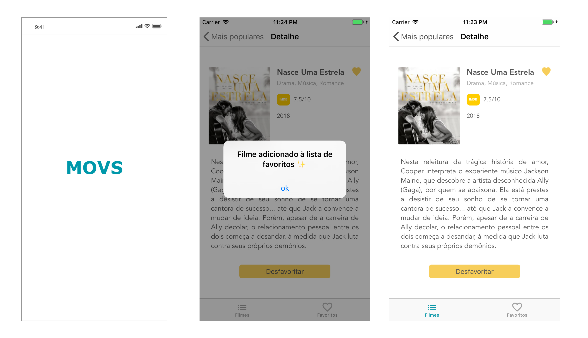
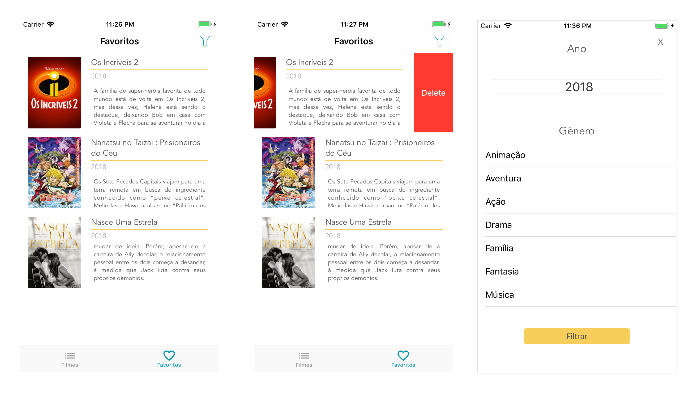

# Concrete iOS Recruit Challenge

---

Criação de um app sobre filmes, usando a [API](https://developers.themoviedb.org/3/getting-started/introduction) do [TheMovieDB](https://www.themoviedb.org/?language=en). 

Optei por utilizar a arquitetura VIP ([Clean Swift](https://clean-swift.com/clean-swift-ios-architecture/)) pois eu a acho muito adequada quando o contexto envolve consultas à API. Ela encapsula comportamentos de request, response, tratamento e apresentação de dados.

# Features 

- [x] Tela de Splash;
- [x] Layout em abas, contendo na primeira aba a tela de grid de filmes e na segunda aba a tela de lista de filmes favoritados no app;
- [x] Tela de grid de filmes trazendo a lista de filmes populares da [API](https://developers.themoviedb.org/3/movies/get-popular-movies).
- [x] Tratamento de erros e apresentação dos fluxos de exceção: Busca vazia, Error generico, loading;
- [x] Ao clicar em um filme do grid deve navegar para a tela de detalhe do filme;
- [x] Tela de Detalhe do filme deve conter ação para favoritar o filme;
- [x] Tela de Detalhe do filme deve conter gênero do filme por extenso (ex: Action, Horror, etc); Uso desse [request](https://developers.themoviedb.org/3/genres/get-movie-list) da API para trazer a lista.
- [x] Tela de lista de favoritos persistido no app entre sessões;
- [x] Tela de favoritos deve permitir desfavoritar um filme.
- [x] Tela de grid com busca local;
- [x] Scroll Infinito para fazer paginação da API de filmes populares;
- [x] Célula do Grid de filmes com informação se o filme foi favoritado no app ou não;
- [x] Tela de filtro com seleção de data de lançamento e gênero. A tela de filtro só é acessível a partir da tela de favoritos;
- [x] Ao Aplicar o filtro, retornar a tela de favoritos e fazer um filtro local usando as informações selecionadas referentes a data de lançamento e gênero;
- Testes unitários no projeto;
- [x] Testes funcionais.
- Pipeline Automatizado

## Frameworks
- A manipulação de favoritos envolve um escopo pequeno de persistência de dados, por isso, optei por utilizar CoreData, que é muito rápido (in-memory) e não aumenta o tamanho do projeto como é o caso do Realm (aproximadamente 78MB)
- O Moya simplifica o uso do Alamofire, sendo uma opção de fácil manipulação e manutenção
- O Kingfisher deixa a busca por imagens em URL's muito simples. Parece que estamos fazendo errado de tão simples.

## Detalhes
- Optei por fazer meu próprio design porque acho que aproveitaria melhor o app e a visualização das informações. Utilizei o Sketch e tomei como referência protótipos do [Davit Petriashvili](https://www.sketchappsources.com/free-source/2103-gomovies-whatch-movies-online-sketch-freebie-resource.html) e [D Design](https://www.sketchappsources.com/free-source/2896-sample-iphone-x-movies-app-sketch-freebie-resource.html)
- A busca local por filmes local é feita sincronizada com o momento que o usuário está digitando
- A parte parte de favoritos atualmente é feita localmente mas a arquitetura permite uma fácil alteração para que seja feita pela API.
- Faço muito uso de Extensions pois adoro como separa comportamentos específicos e deixa o código limpo.
- Utilizo Factory para simplificar a criação de objetos e configuração de dependências paras as Scenes 

### Lista de filmes populares

### Detalhes

### Favoritos

